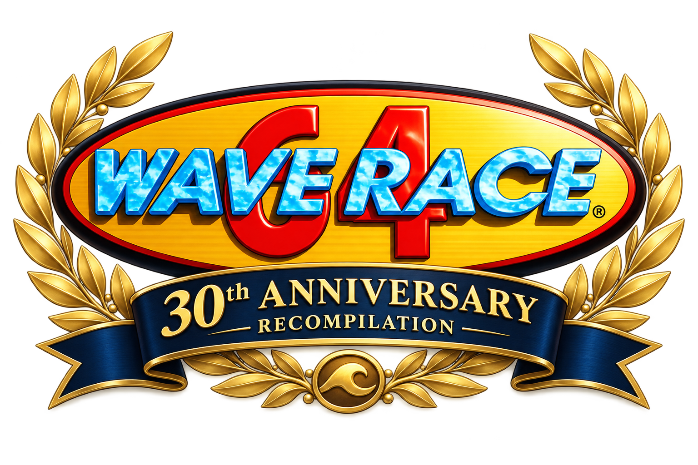
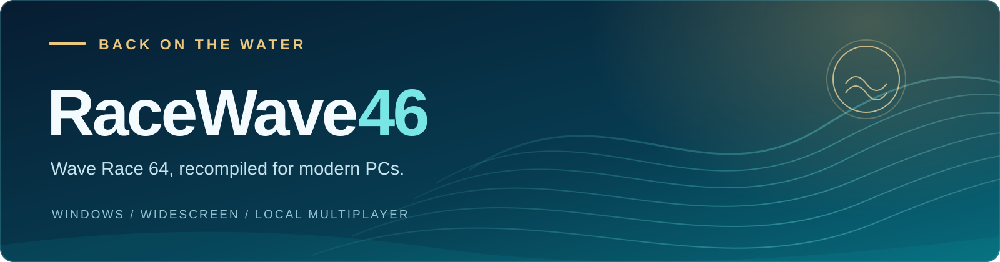

  

# RaceWave46

**A fan-made Windows recompilation of Wave Race 64, celebrating 30 years on the water.**

RaceWave46 brings the USA Rev 1 version of Wave Race 64 to modern PCs, with higher resolutions, smooth interpolated presentation, widescreen support, new graphics options and expanded local multiplayer. It keeps the original racing at its heart: reading the waves, leaning into a turn, threading the buoys and finding the fastest line.

The project has been under active development for many months. That time has gone into bringing up the game, revisiting its rendering and interfaces, adding enhancements, and repeatedly testing races, menus, course introductions and the championship ending. The aim is to make this classic more comfortable to play today while preserving its character.

> **v1.0.0 is available now.** [Download for Windows](https://github.com/DomazinUS/RaceWave46/releases/download/v1.0.0/RaceWave46-Windows-x64-v1.0.0.zip) · [Source and release notes](https://github.com/DomazinUS/RaceWave46/releases/tag/v1.0.0).

[The original game](#the-original-game) · [Added features](#what-racewave46-adds) · [Graphics API support](#graphics-api-support) · [Getting started](#getting-started) · [AI assistance](#ai-assistance) · [Source and license](#source-and-license) · [Credits](#credits)

## The original game

RaceWave46 retains the original game's modes and progression:

| Feature | What you can play |
| --- | --- |
| **Championship** | Race through the championship, earn points, unlock further challenges and reach the podium. |
| **Time Trials** | Chase faster laps and course records. |
| **Stunt Mode** | Take on the game's stunt challenges and score-based play. |
| **Two-player racing** | Local head-to-head races with two independently controlled riders. |
| **Dolphin Park** | The original practice and warm-up setting. |
| **Riders and difficulty** | Ryota Hayami, Dave Mariner, Ayumi Stewart and Miles Jeter, their distinct characteristics, and the game's Normal, Hard, Expert and Reverse progression. |
| **Rider tuning and game options** | Rider renaming, handling/engine/grip tuning, camera choices, wave and lap settings, and the original two-player handicap and color choices. |
| **Water and course design** | The original wave-driven handling, buoy rules, power system, jumps, changing water conditions and course obstacles. |
| **Presentation and progress** | Original music, sound effects, race commentary, records, unlocks and championship results. |

The eight race courses are Sunny Beach, Sunset Bay, Drake Lake, Marine Fortress, Port Blue, Twilight City, Glacier Coast and Southern Island, alongside Dolphin Park.

## What RaceWave46 adds

### Modern presentation

| Feature | Details |
| --- | --- |
| **Native Windows application** | Built around N64Recomp and RT64, with a dedicated frontend and direct executable launch. |
| **Resolution options** | 1× (the 240-line base), 2×, 3×, 4×, 4.5×, 5×, 6× and 9× multipliers, plus Auto. |
| **Widescreen and ultrawide** | A 16:9 base view, with Expand supporting wider displays including 21:9 and 32:9. Menus and HUD placement adapt to wider layouts; 4:3 displays are letterboxed. |
| **Frame-rate choices** | Original, display refresh rate or a manual target, with interpolation for supported scene movement, cameras, HUD elements and menus. |
| **Anti-aliasing and downsampling** | MSAA options on supported hardware, plus downsampling at 1× and 2× resolution. |
| **HUD placement** | Original, 16:9 and expanded placement choices. |
| **HUD & Menu Filtering** | Original, Light and Enhanced filtering for supported original game text and HUD textures. |
| **Field of View** | Up to 10 extra degrees for the chase camera in one-player and two-player races. |
| **Wave Roundness** | Adjustable rounding of rendered waves, with 50% as the default. |
| **Window modes** | Fullscreen startup, windowed play and fullscreen toggling with F11 or Alt+Enter. |

### Water, sky, shadows and visibility

| Feature | Details |
| --- | --- |
| **Water Reflections** | Original, Rasterized or Ray Traced rendering. The added methods reflect scenery and objects on the water. |
| **Independent Sky Reflections** | A separate switch and choice of Rasterized or Ray Traced reflections for the sky and celestial effects. |
| **Shadows** | Original, Rasterized or Ray Traced shadows, with work covering course worlds, introductions and the ending. |
| **Contextual quality controls** | Reflection Distance appears beneath Ray Traced water; Soft Shadow Quality appears beneath Ray Traced shadows when its required water mode is active. Rasterized shadows expose Shadow Draw Distance. |
| **Rasterized reflection strength** | Adjust the visibility of rasterized sky reflections. |
| **Buoy Draw Distance** | Original, 1.5× and 2× visibility for checkpoint and course-boundary buoys. |
| **Object Draw Distance** | Original through 3× for supported static scenery. The 3× option also extends the lettered Dolphin Park entrance. |
| **Water Surface and Seabed Distance** | Separate controls, up to 5×, for the outer water surface and underwater floor. |
| **Cloud coverage** | Original or Extended coverage, including the championship ending's camera angles. |
| **Scene and interface refinements** | Work on sun visibility and shadow direction, camera transitions, scrolling ending results, watercraft previews, banner seams and finish-position alignment. |

### Graphics API support

| Feature | Direct3D 12 | Vulkan |
| --- | --- | --- |
| Original game rendering | Supported | Supported |
| Added Rasterized water reflections, sky reflections and shadows | Supported | Unavailable |
| Added Ray Traced water reflections, sky reflections and shadows | Requires compatible ray-tracing hardware | Unavailable |
| Separate player windows | Supported | Unavailable |
| Horizontal and vertical split screen, enhanced two-player detail and Dolphin Park Free Ride | Supported | Supported |
| Widescreen, frame interpolation, HUD filtering, Wave Roundness, draw-distance controls and extended cloud coverage | Shared implementation | Shared implementation |

The settings screen disables unavailable choices and explains their requirements. Availability follows the active renderer, including when Graphics API is set to Auto. Ray Traced options require **DXR 1.1 / Shader Model 6.5** support; Ray Traced shadows also require Ray Traced Water Reflections. MSAA depends on the device's supported sample counts and sample-position capabilities.

Changing APIs retains your saved enhancement preferences. Until their requirements are met, unavailable water/shadow choices use the original rendering, sky reflections stay inactive, and a saved Separate windows choice uses Horizontal split screen. Shared implementations remain subject to each feature's course and mode requirements; this table is not a guarantee against driver-specific issues.

The initial defaults use **Original** water reflections and shadows, with **Sky Reflections off**. Graphics start with **Direct3D 12**, Auto resolution, the display's refresh rate and MSAA off; the field of view is widened by 5 degrees. Fullscreen startup is retained. The experimental Wave Draw Distance control is hidden and inactive in this release, including when an older profile retains an Extended setting.

### More ways to play together

| Feature | Details |
| --- | --- |
| **Horizontal split** | The familiar player-one-above-player-two layout. |
| **Vertical split** | Side-by-side views, recommended for 32:9 displays so each player gets a 16:9 view. |
| **Separate windows** | During a two-player course, each player gets a separate 16:9 window. Move Player 2 to a second monitor for a screen each. |
| **Persistent second window** | Menus stay on the primary window. Player 2's window stays black between courses and resumes with the next level. |
| **Enhanced two-player detail** | Restores single-player scenery, water materials, sky detail, detailed checkpoint buoys and native wildlife across the race courses. |
| **Dolphin Park Free Ride** | An optional two-player Dolphin Park session with its music and sound effects, without tutorial instructions, narration or race rules. Explore together at your own pace. |

Separate windows requires Direct3D 12. Both windows share the primary window's resolution and frame-rate settings. Select the display layout and Enhanced visual detail before loading a course. Added two-player reflections and shadows require Enhanced detail. Enhanced detail also restores the cloud and visible seabed layers used by their extension settings. Wave Roundness and Water Surface Distance work with both detail modes.

### Controls, saves and extras

| Feature | Details |
| --- | --- |
| **Configurable controls** | Keyboard and controller bindings, profiles, player assignment and a controller diagram showing the selected bindings. |
| **Gameplay rumble** | A master toggle and independent strength settings for Player 1 and Player 2. |
| **Input preferences** | Joystick deadzone and background controller-input settings. Keyboard input follows the primary window's focus. |
| **Local progress** | Settings, imported ROM data, saves and ghosts stay in the installation's `.runtime` directory. Keep it when updating. |
| **Dolphin Time Trial ghost** | Added to this USA port: best-run recording and automatic saving/loading by course, difficulty and Reverse mode. A visibility setting lets you show or hide the ghost without disabling recording. |
| **Texture packs and mods** | A Mods interface for compatible packs. Texture packs are optional and are not included in the Windows ZIP. |
| **RetroAchievements** | Account sign-in, achievement browsing, account progress and animated softcore unlock notifications. |
| **Volume control** | A frontend master-volume slider alongside the original game's Sound menu. |
| **Anniversary frontend** | The 30th Anniversary logo, a dedicated Windows icon and a menu inspired by the original manual. |

RetroAchievements currently supports one signed-in account, including during two-player play. Hardcore mode and leaderboard submissions are not included. Multiplayer is local; online play is not included.

Normal progress and records are saved automatically, but the original Controller Pak Save/Load operations are not implemented. Manual ghost-file management is not exposed in this release.

## Getting started

The first release targets **Windows 10/11, 64-bit**. Detailed performance requirements are still being evaluated; resolution, additional effects and running two player windows all affect GPU load.

1. Extract the entire Windows release ZIP into a writable folder.
2. Open **WaveRace64Recompiled.exe**. The application starts in fullscreen.
3. Choose **Select USA ROM** and import your own **Wave Race 64 USA Rev 1** ROM.
4. Choose **Start Game**. Open **Settings** to adjust the presentation and enhancements.

No game ROM, personal save, account credentials or installed texture packs are included. The release requires your own supported ROM; this project does not provide game downloads. The executable keeps its existing name even though the project is called RaceWave46.

For an update, keep your `.runtime` directory. Compatible texture packs can be installed through **Settings → Mods**. RetroAchievements sign-in is available under **Settings → Achievements**.

## AI assistance

**RaceWave46 is an AI-assisted recompilation.** AI tools have been used for code implementation, debugging, research and documentation. Project direction, review decisions and hands-on gameplay testing remain my responsibility as the maintainer.

## Source and license

**The project's original contributions are licensed under GPL-3.0-only.** Third-party components retain their applicable licenses and notices, including [N64ModernRuntime's GPLv3 license](https://github.com/N64Recomp/N64ModernRuntime/blob/main/COPYING). The source is included in this repository and in the corresponding source ZIP. The Windows and corresponding source packages are available from the [**v1.0.0** release](https://github.com/DomazinUS/RaceWave46/releases/tag/v1.0.0).

The source includes the modified dependencies and checked-in generated code needed for the Windows build. See [BUILDING.md](BUILDING.md) for build instructions, [LICENSE](LICENSE) and [COPYING](COPYING) for the project's license, and [THIRD-PARTY-NOTICES.md](THIRD-PARTY-NOTICES.md) for component notices. Building does not require a ROM; playing requires your own supported ROM.

## Credits

This project exists because of the tools, research and sustained work of the wider Nintendo 64 recompilation community.

- **[Wiseguy / Mr-Wiseguy](https://github.com/Mr-Wiseguy)** — creator of **[N64Recomp](https://github.com/N64Recomp/N64Recomp)**, the static recompilation tool at the foundation of this project. Thanks also to its contributors and maintainers.
- **[Darío / DarioSamo](https://github.com/DarioSamo), Wiseguy and the [RT64 contributors](https://github.com/rt64/rt64/graphs/contributors)** — for **[RT64](https://github.com/rt64/rt64)** and the rendering foundation that makes modern presentation and additional effects possible.
- **The [N64ModernRuntime](https://github.com/N64Recomp/N64ModernRuntime) and [RecompFrontend](https://github.com/N64Recomp/RecompFrontend) contributors** — for the runtime, input and frontend infrastructure used by this project.
- **[Chris Lewis](https://blog.chrislewis.au/)** — his writing about decompiling and recompiling **Snowboard Kids 2** provided valuable reading and practical insights throughout this work. His explanations of debugging, tooling and AI-assisted investigation deserve particular thanks. Recommended reading: [Using Coding Agents to Decompile Nintendo 64 Games](https://blog.chrislewis.au/using-coding-agents-to-decompile-nintendo-64-games/) and [Snowboard Kids 2 is Recompiled](https://blog.chrislewis.au/snowboard-kids-2-is-recompiled/).
- **[RetroAchievements](https://retroachievements.org/) and the [rcheevos contributors](https://github.com/RetroAchievements/rcheevos)** — for achievement services and integration libraries.
- **Nintendo and the original Wave Race 64 team** — for the game, its design, music and enduring character.
- **The wider community and testers** — for the tools, documentation, feedback and repeated playtesting that help improve projects like this.

These credits acknowledge the upstream work and writing used by RaceWave46; they do not imply that those people maintain, endorse or have reviewed this project. Third-party license and asset notices accompany the Windows build.

## Feedback

Useful reports should include the course and game mode, what happened, how to reproduce it, the release version, GPU and driver, selected graphics API, resolution and relevant enhancement settings. A short video or screenshot is especially helpful for rendering issues. Please do not attach ROMs, account credentials or personal tokens.

RaceWave46 is an unofficial fan project and is not affiliated with or endorsed by Nintendo.
